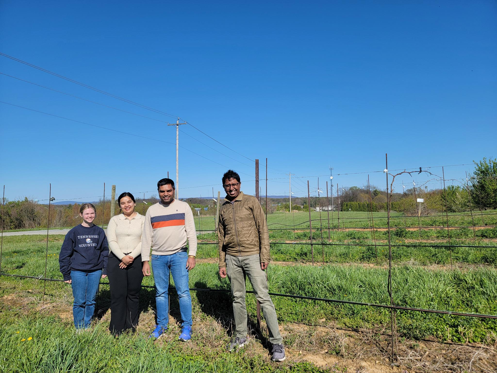
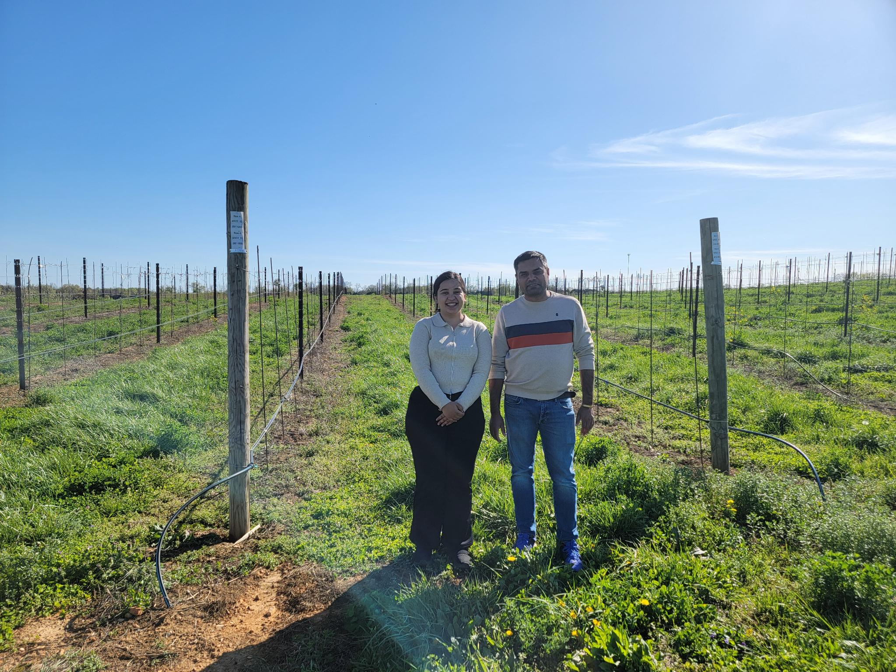
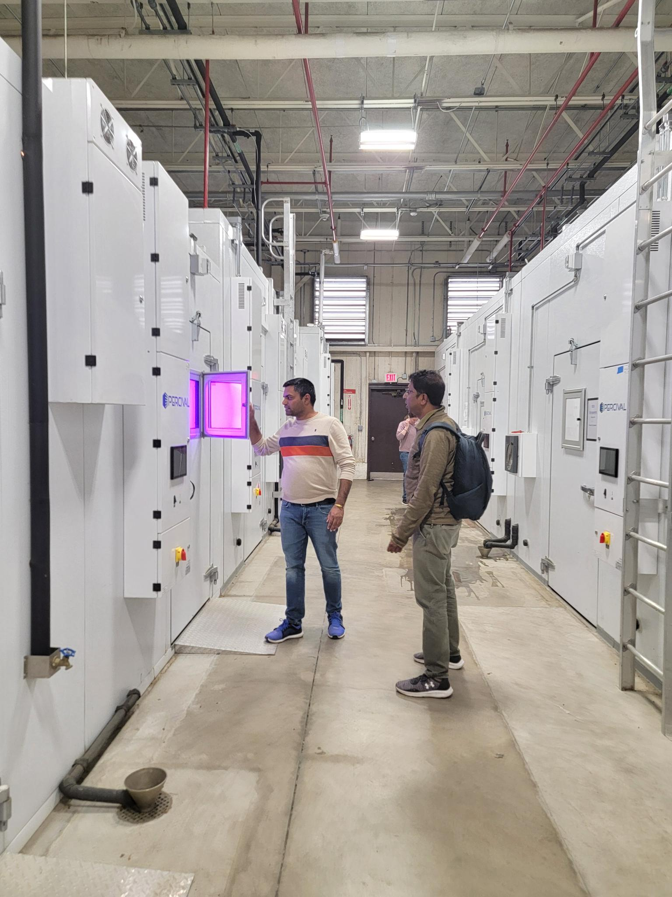
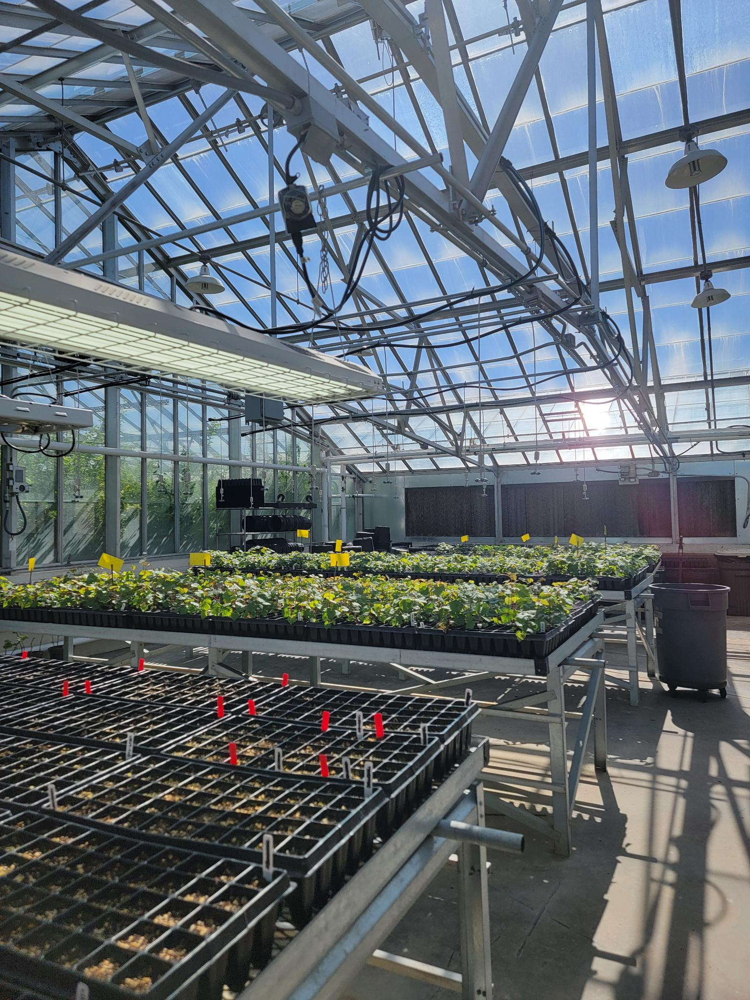

 USDA Visit 

---

We visited Appalachian Fruit Research Station of United States Department of Agriculture (USDA) in Kearneysville, West Virginia. Our collaborator, Dr. Surya Sapkota hosted us. Dr. Sapkota has newly established a grape breeding program that is focused on improving grape genetics to sustain challenges of mid-Atlantic to east South Central United States. Abby (Abigail Scott) learned grape propagation techniques, whereas Anugya learned high-throughput downy mildew phenotyping using Dr. Sapkota's amazing **Blackbird** robotic system.

